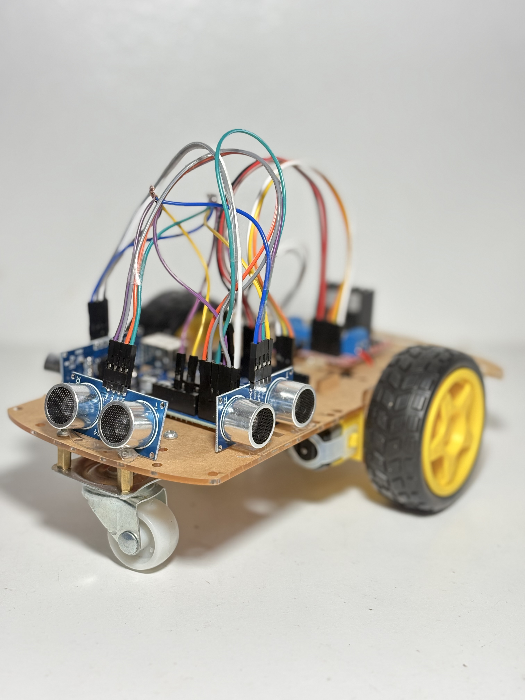
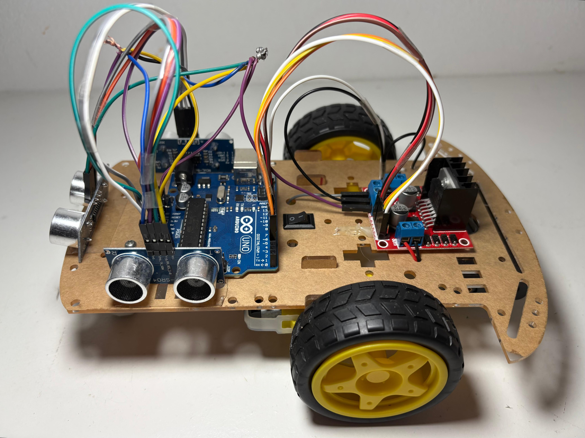
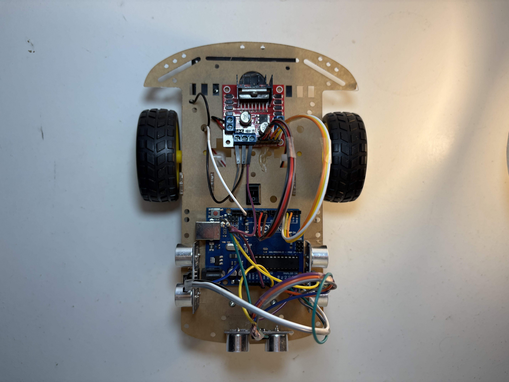
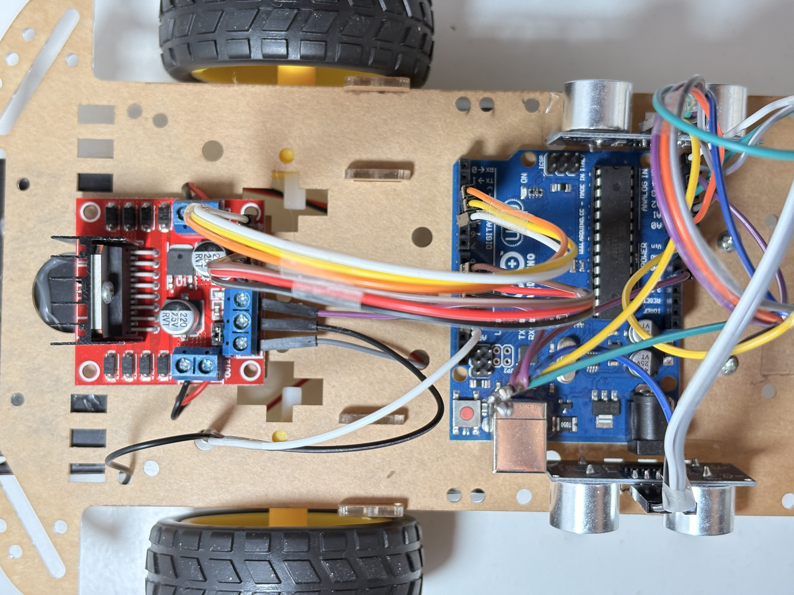
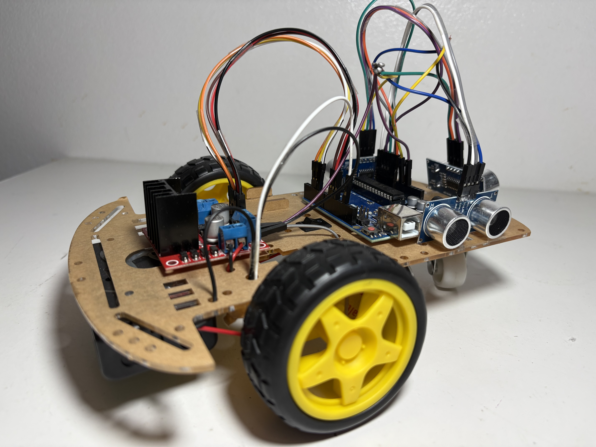
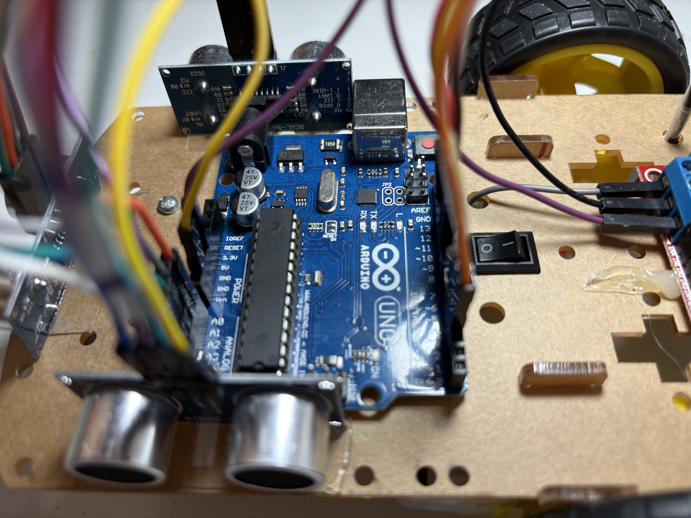
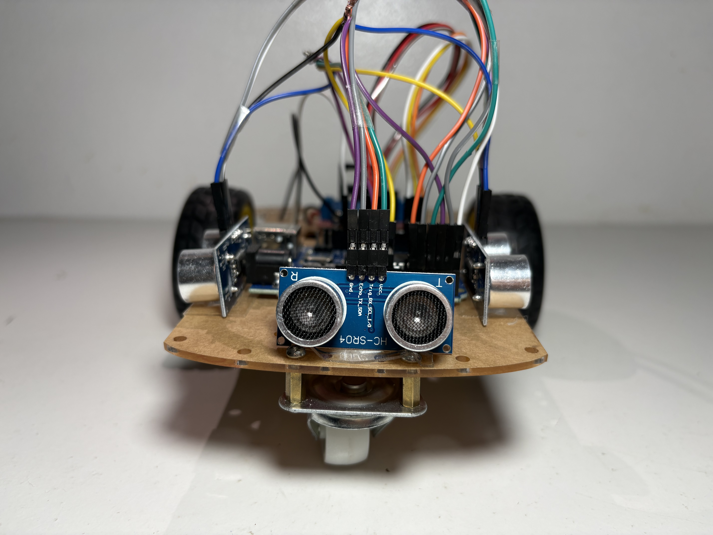
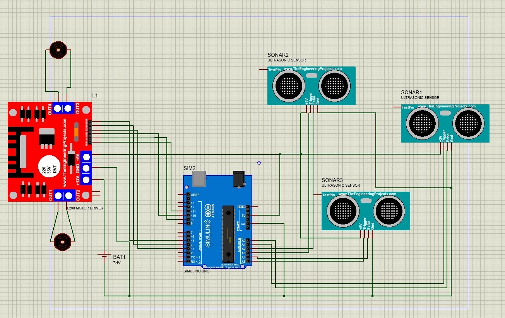

# Autonomous Maze-Solving Robot

<p align="center">


</p>

<p align="center">
  
</p>

<p align="center">
An autonomous maze-solving robot designed and built using an Arduino Uno, ultrasonic sensors, and embedded programming.
</p>

---

## Overview

This project was developed as part of the second-year engineering curriculum at **EMSI Tangier**.

The objective was to design and build an autonomous mobile robot capable of navigating a maze without human intervention. Using three HC-SR04 ultrasonic sensors, the robot continuously measures the distance to nearby obstacles, analyzes its surroundings in real time, and determines the most appropriate path to follow.

The navigation algorithm runs on an Arduino Uno, which processes sensor data and sends commands to an L298N motor driver controlling two DC motors. Before building the physical prototype, the complete electronic circuit was designed and validated using Proteus ISIS.

The project combines embedded programming, electronics, sensor integration, motor control, and hardware prototyping into a complete autonomous robotic system.

---

## Key Features

- Autonomous maze navigation
- Real-time obstacle detection
- Arduino Uno based control system
- Embedded navigation algorithm
- L298N dual H-Bridge motor driver
- Three HC-SR04 ultrasonic sensors
- Proteus circuit simulation
- Physical prototype implementation

---

## Hardware Components

| Component | Description |
|-----------|-------------|
| Arduino Uno | Main microcontroller |
| HC-SR04 ×3 | Ultrasonic distance sensors |
| L298N | Dual H-Bridge motor driver |
| DC Motors ×2 | Robot locomotion |
| Robot Chassis | Mechanical structure |
| Swivel Caster Wheel | Front support |
| 7.4V Battery | Power supply |

---

## Software & Tools

- Arduino IDE
- Arduino Programming Language (C/C++)
- Proteus ISIS
- Tinkercad
- Git
- GitHub

---

## Project Gallery

<p align="center">
  
  
</p>

<p align="center">
  
  
</p>

<p align="center">
  
  
</p>

<p align="center">
  
</p>

---

## System Architecture

The robot follows the workflow below:

1. Measure distances using the three ultrasonic sensors.
2. Detect nearby obstacles.
3. Compare measured distances with the safety threshold.
4. Determine the safest direction.
5. Control the motors through the L298N motor driver.
6. Repeat the process continuously while navigating the maze.

---

## Project Structure

```text
autonomous-maze-robot/
│
├── code/
│   └── autonomous_maze_robot.ino
│
├── docs/
│   ├── project-rapport.pdf
│   └── project_presentation.pdf
│
├── hardware/
│   └── proteus_schematic.JPG
│
├── images/
│   ├── robot_front_view.JPG
│   ├── robot_side_view.JPG
│   ├── robot_top_view.JPG
│   ├── hardware_layout.JPG
│   ├── electronics_closeup.JPG
│   ├── arduino_uno_closeup.JPG
│   └── robot_front_closeup.JPG
│
├── LICENSE
└── README.md
```

---

## Proteus Circuit

<p align="center">
  
</p>

The complete electronic circuit was designed and tested using Proteus ISIS before being implemented on the physical prototype.

---

## Documentation

The complete project documentation is available in the **docs** directory.

- **Project Report:** `project_rapport.pdf`
- **Project Presentation:** `project_presentation.pdf`

---

## Challenges & Lessons Learned

Developing the robot highlighted several practical challenges that are difficult to anticipate during simulation.

Throughout the project, we faced issues related to unstable electrical connections, sensor accuracy, motor synchronization, and navigation precision. Solving these problems required multiple iterations of testing, debugging, and hardware adjustments.

This experience demonstrated the importance of validating theoretical designs through real-world experimentation and significantly strengthened our practical skills in embedded systems, electronics, programming, and teamwork.

---

## Authors

This project was developed by:

- **Alae Ddin El Mouden**
- Fouad Aadiati
- Mohammed El Musawi
- Hatim ERRami

**Institution:** EMSI Tangier  
**Academic Year:** 2025–2026

---

## License

This project is licensed under the MIT License. See the **LICENSE** file for more information.
